# Style Box

The Style Box is a platform that integrates the idea of e-commerce and social network. It has three sections: ‘design for you’, ‘design for others’ and ‘favorite ootd sharing’. The Style Box lets the customer get customized clothing shopping experience, gives stylists opportunities to show their talents and maintains an active fashion community. Our platform provides one-stop service, including outfit fixing, shopping, and delivery. The customer can pick up a stylist on our website to help them select clothing items and design the outfits. The customer will get a style report and buy all the clothing items on our website. Eventually, a style box would be delivered to the customer containing all they need to become a fashion insider.

## User Manual

Users can visit our website here: http://121.41.106.214/.

Users can register as customer or stylist by selecting corresponding role when registration.

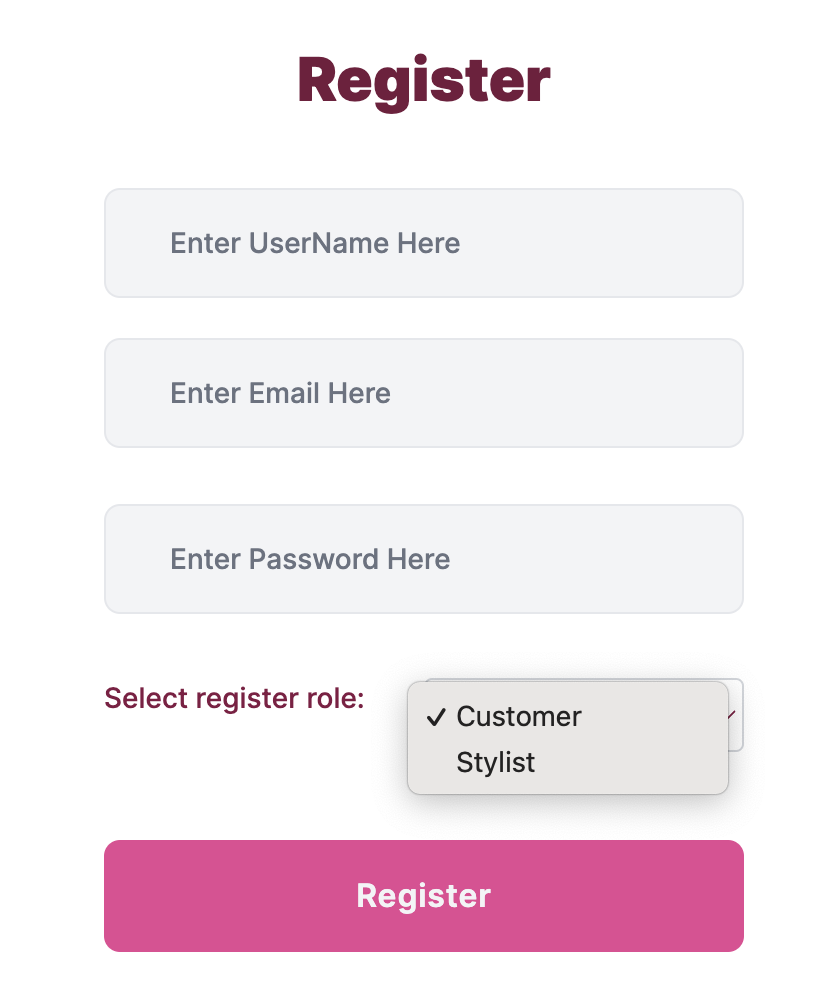

#### Login as Customer

1. <b>Customer Profile</b>

   - When first login as a customer, the user would be asked to finish a quiz.

     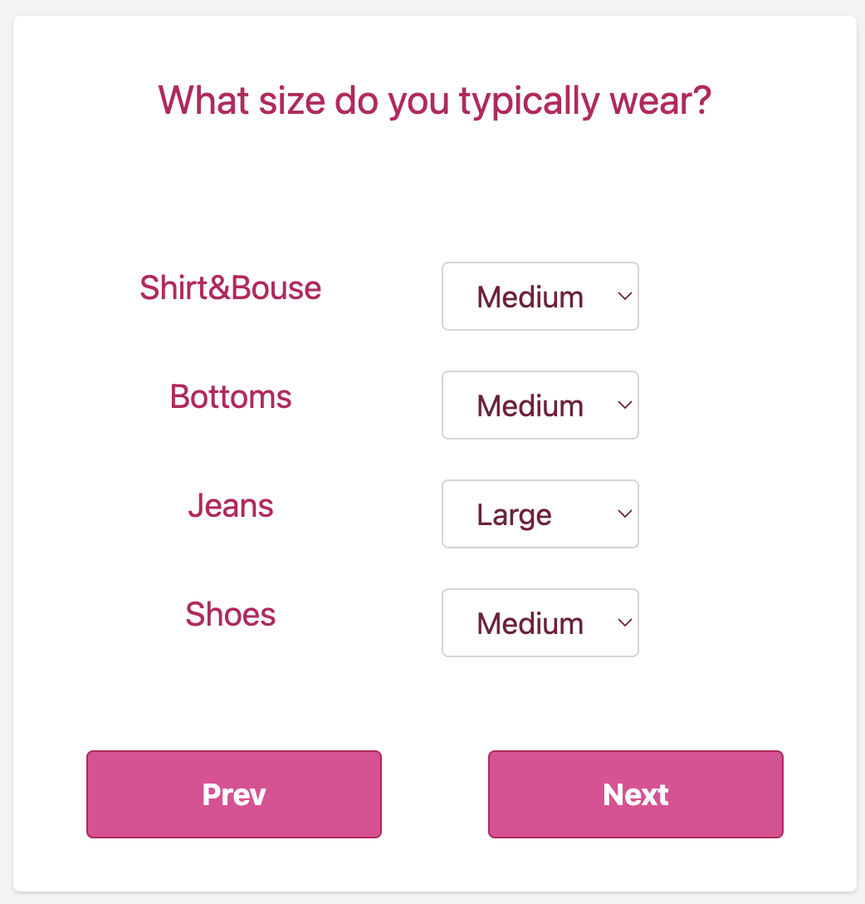

   - The result of quiz will automatically fill the customer profile.

     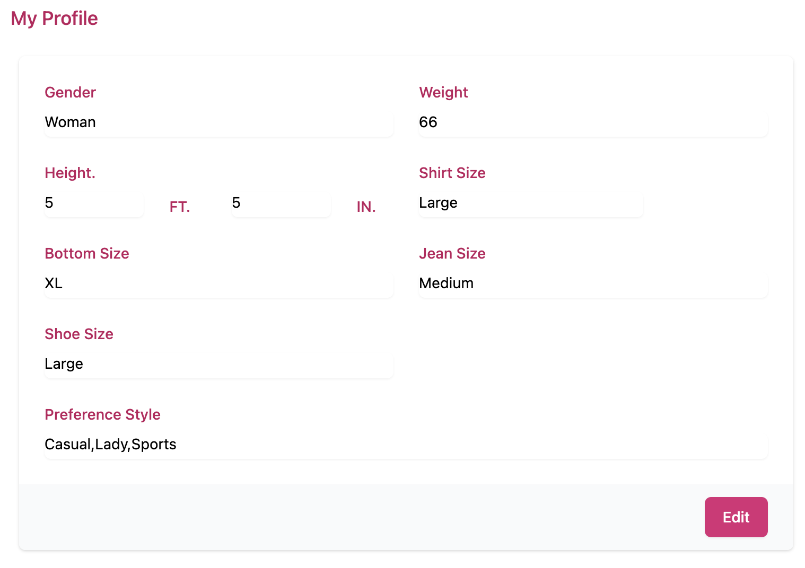

   - Customer can manually edit the customer profile. It can be found at *Account->Customer Profile*.

     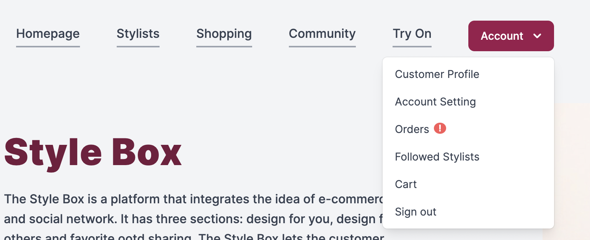

   - When customer places order, the customer profile will be delivered to stylists to help them design the outfit.

     

2. <b>Choose favorite stylist</b>

   - Customer can browser all stylists by clicking *Stylists* button on navbar.

     

   - The stylists can be searched based on rate, followNum, orderNum, skilled style and keywords.

     

   - After entering the stylist page by clicking *Learn More* Button, customer can view stylist's information and past designs. Then the customer can follow the stylist or send order request by clicking corresponding button.

     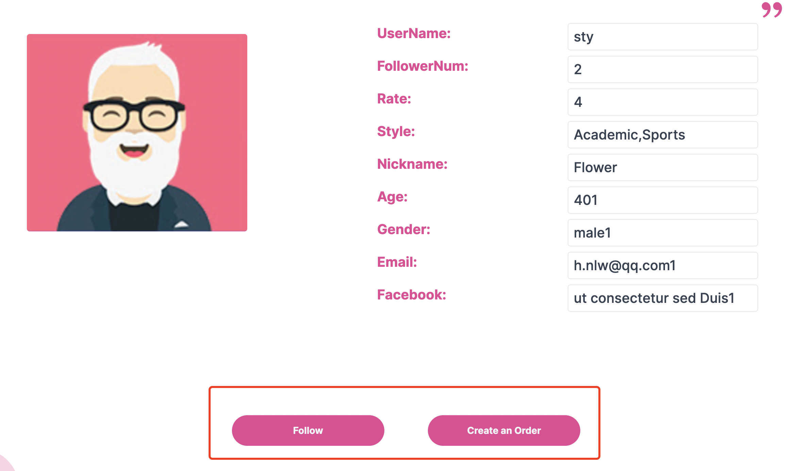

     

3. <b>Order Management</b>

   - After clicking *Create an Order* button on a stylist's homepage, the customer will be directed to the create order page, where they can fullfill the order related information.

     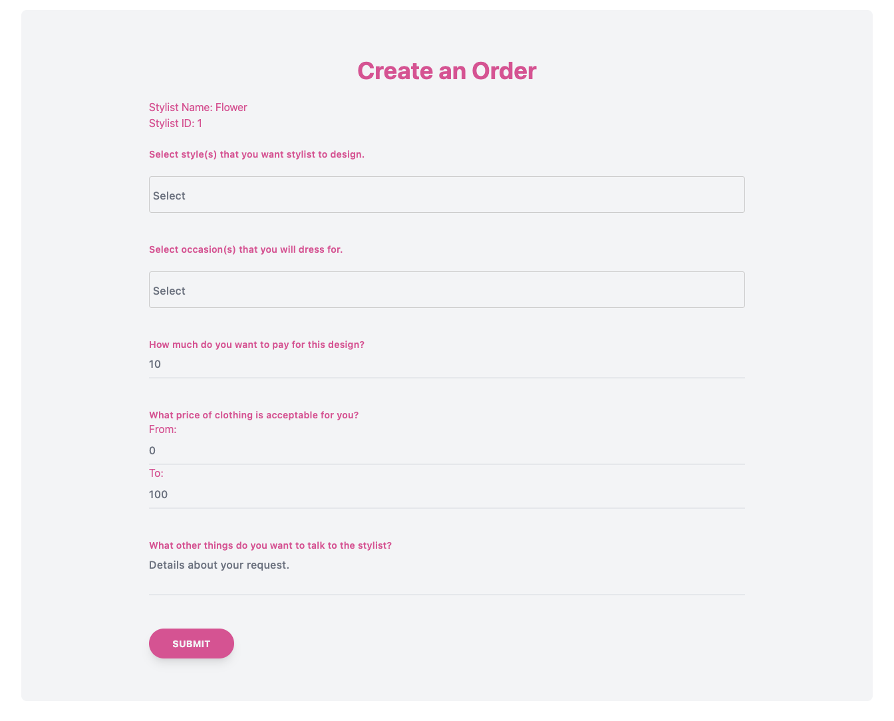

   - Notice that the stylist may not accept the order, the customer can keep track of order updates at *Account->Orders*.

     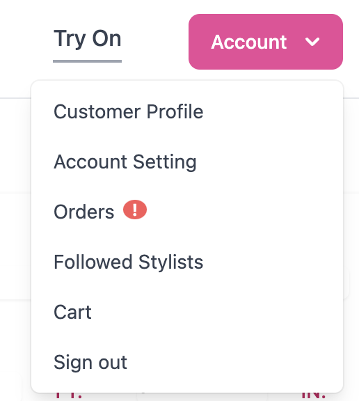

   - The exclamation marks on the order list page indicate the order has an update. There are six status of order shown as follows: 

     ​            (1)  To be accepted: The stylist has not accepted the order

     ​			(2)  Refused: The stylist has refused to accept the order

     ​			(3)  To be paid: The order is accepted and customer has to pay for the design fee before the stylist start to design.

     ​			(4)  In progress: The order is waited to be finished by stylist

     ​			(5) To be confirmed: The style report is finished and customer can confirm and rate the order.

     ​			(6)  Completed: The order is completed.

     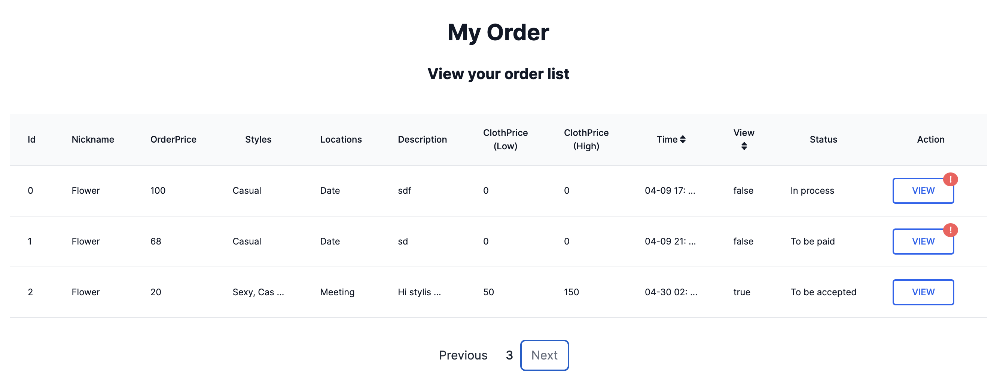

     ​	In each state, the customer can click *VIEW* button and do corresponding operation.

     

   - In the end, the customer will receive a style report containing the overview look, recommended items, item links, design ideas and so on.

#### Login as Stylist

1. <b>Stylist Profile</b>

   - The stylist can view and modify their Stylist Profile at *Account->Stylist Profile*

     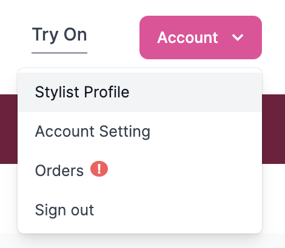

   - By clicking *Edit* button, the stylist can change their basic information.

     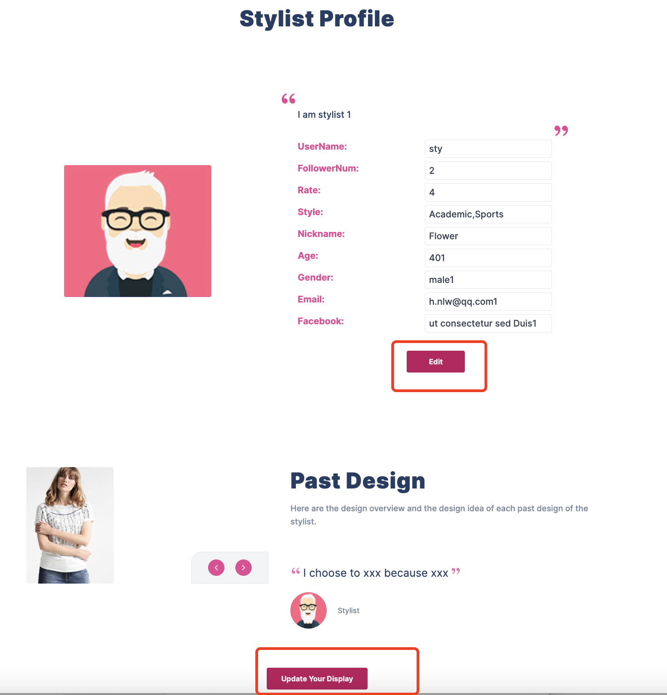

   - By clicking *Update Your Display* button, stylist can modify their past design.

     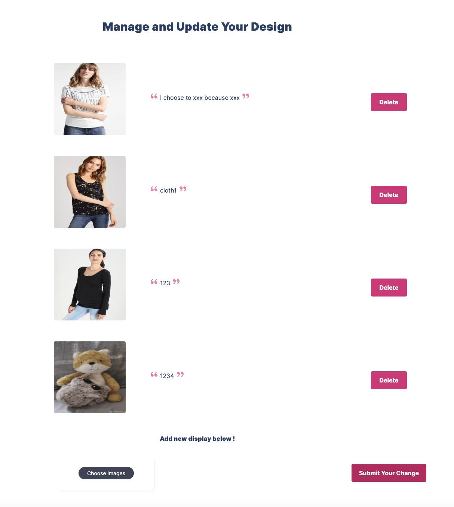

     

     

2. <b>Order Management</b>

   - When there are new orders, the stylist will see a exclamation mark on *Account->Orders* button.

     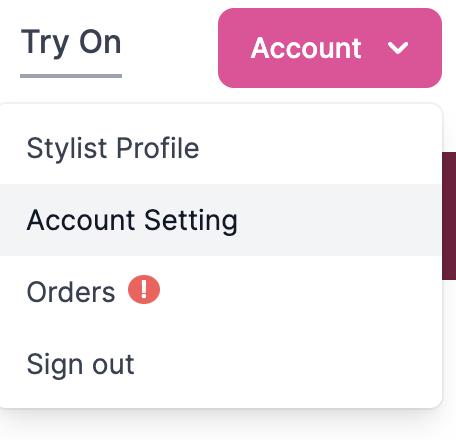

     

   - As described in <b>Login as Customer</b> section, the order has six status. 

     - To be accepted Status: Stylist can choose to accept or refuse the order request by clicking *VIEW->Manage*.

       

     - In process Status: Stylist can start to finish the style report at *Account->Orders->VIEW->Create Report* .

       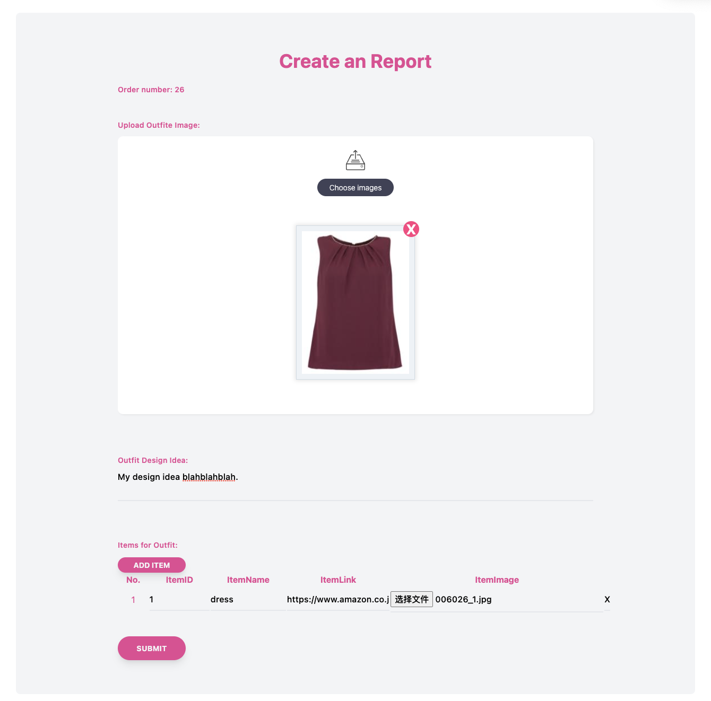

#### Other function

1. Virtual try on

   - By clicking *Try On* button on navbar, user will be directed to virtual try on page.

     

   - User can use use the try-on function by selecting a human photo and a cloth image.

2. ChatBot

   - User can find chatbot on the homepage.

     

   -  The chatbot will answer basic questions to help customer better understand how to use our website.
   
     
   
     
     
     

## API Reference

### User

#### GET get account setting

GET /account

##### Response data

status code **200**

| Name       | Type   | Required | Restriction | Description |
| ---------- | ------ | -------- | ----------- | ----------- |
| » email    | string | true     | none        | none        |
| » phone    | string | true     | none        | none        |
| » address  | string | true     | none        | none        |
| » payment  | string | true     | none        | none        |
| » facebook | string | true     | none        | none        |
| » nickname | string | true     | none        | none        |
| » username | string | true     | none        | none        |

#### POST modify account setting

POST /account

##### Request Param

| Name       | Position | Type   | Required | Description |
| ---------- | -------- | ------ | -------- | ----------- |
| body       | body     | object | false    | none        |
| » email    | body     | string | true     | none        |
| » phone    | body     | string | true     | none        |
| » address  | body     | string | true     | none        |
| » payment  | body     | string | true     | none        |
| » facebook | body     | string | true     | none        |
| » nickname | body     | string | true     | none        |

##### Response

|200|[OK](https://tools.ietf.org/html/rfc7231#section-6.3.1)|

#### POST create customer profile

POST /customer/profile

##### Request Param

| Name         | Position | Type     | Required | Description |
| ------------ | -------- | -------- | -------- | ----------- |
| body         | body     | object   | false    | none        |
| » gender     | body     | string   | true     | none        |
| » ftSize     | body     | string   | true     | none        |
| » inSize     | body     | string   | true     | none        |
| » weight     | body     | string   | true     | none        |
| » shirtSize  | body     | string   | true     | none        |
| » bottomSize | body     | string   | true     | none        |
| » jeanSize   | body     | string   | true     | none        |
| » shoeSize   | body     | string   | true     | none        |
| » styleSet   | body     | [string] | true     | none        |

##### Response

|200|[OK](https://tools.ietf.org/html/rfc7231#section-6.3.1)|Success|Inline|

#### GET get customer profile

GET /customer/profile

##### Response

status code **200**

| Name         | Type     | Required | Restriction | Description |
| ------------ | -------- | -------- | ----------- | ----------- |
| » gender     | string   | true     | none        | none        |
| » ftSize     | string   | true     | none        | none        |
| » inSize     | string   | true     | none        | none        |
| » weight     | string   | true     | none        | none        |
| » shirtSize  | string   | true     | none        | none        |
| » bottomSize | string   | true     | none        | none        |
| » jeanSize   | string   | true     | none        | none        |
| » shoeSize   | string   | true     | none        | none        |
| » style      | [string] | true     | none        | none        |

#### POST register

POST /register/{role}

##### Request Param

| Name       | Position | Type   | Required | Description           |
| ---------- | -------- | ------ | -------- | --------------------- |
| role       | path     | string | true     | if customer 0; else 1 |
| body       | body     | object | false    | none                  |
| » password | body     | string | true     | none                  |
| » email    | body     | string | true     | none                  |
| » username | body     | string | true     | none                  |

##### Response

|200|[OK](https://tools.ietf.org/html/rfc7231#section-6.3.1)|Success|Inline|

#### GET get stylist profile

GET /stylist/profile

##### Response

status code **200**

| Name          | Type     | Required | Restriction | Description |
| ------------- | -------- | -------- | ----------- | ----------- |
| » nickname    | string   | true     | none        | none        |
| » photo       | string   | true     | none        | none        |
| » intro       | string   | true     | none        | none        |
| » gender      | string   | true     | none        | none        |
| » style       | [string] | true     | none        | none        |
| » age         | integer  | true     | none        | none        |
| » userName    | string   | true     | none        | none        |
| » email       | string   | true     | none        | none        |
| » facebook    | string   | true     | none        | none        |
| » rate        | integer  | true     | none        | none        |
| » followerNum | integer  | true     | none        | none        |
| » likeNum     | integer  | true     | none        | none        |
| » display     | [object] | true     | none        | none        |
| »» image      | string   | true     | none        | none        |
| »» idea       | string   | true     | none        | none        |

#### POST create stylist profile

POST /stylist/profile

##### Request Param

| Name     | Position | Type     | Required | Description |
| -------- | -------- | -------- | -------- | ----------- |
| body     | body     | object   | false    | none        |
| » photo  | body     | string   | true     | none        |
| » intro  | body     | string   | true     | none        |
| » gender | body     | string   | true     | none        |
| » style  | body     | [string] | true     | none        |
| » age    | body     | integer  | true     | none        |

##### Response

|200|[OK](https://tools.ietf.org/html/rfc7231#section-6.3.1)|Success|Inline|

#### POST login

POST /login

##### Request Param

| Name       | Position | Type   | Required | Description |
| ---------- | -------- | ------ | -------- | ----------- |
| body       | body     | object | false    | none        |
| » password | body     | string | true     | none        |
| » username | body     | string | true     | or email    |

##### Response

|200|[OK](https://tools.ietf.org/html/rfc7231#section-6.3.1)|Success|Inline|

#### GET logout

GET /user/logout

##### Response

|200|[OK](https://tools.ietf.org/html/rfc7231#section-6.3.1)|Success|Inline|

#### POST upload image

POST /image

##### Request Param

| Name    | Position | Type           | Required | Description |
| ------- | -------- | -------------- | -------- | ----------- |
| body    | body     | object         | false    | none        |
| » image | body     | string(binary) | false    | none        |

##### Response

|200|[OK](https://tools.ietf.org/html/rfc7231#section-6.3.1)|Success|Inline|

#### GET get image

GET /images

##### Request Param

| Name     | Position | Type   | Required | Description |
| -------- | -------- | ------ | -------- | ----------- |
| filename | query    | string | false    | none        |

##### Response

|200|[OK](https://tools.ietf.org/html/rfc7231#section-6.3.1)|Success|Inline|

#### POST create stylist display

POST /stylist/display

##### Request Param

| Name        | Position | Type           | Required | Description |
| ----------- | -------- | -------------- | -------- | ----------- |
| ideas       | query    | string         | false    | none        |
| body        | body     | object         | false    | none        |
| » images    | body     | string(binary) | false    | none        |
| » ideas     | body     | string         | false    | none        |
| » deletedID | body     | string         | false    | none        |

##### Response

|200|[OK](https://tools.ietf.org/html/rfc7231#section-6.3.1)|Success|Inline|

#### POST upload avatar

POST /avatar

##### Request Param

| Name  | Position | Type           | Required | Description |
| ----- | -------- | -------------- | -------- | ----------- |
| body  | body     | object         | false    | none        |
| » img | body     | string(binary) | false    | none        |

##### Response

|200|[OK](https://tools.ietf.org/html/rfc7231#section-6.3.1)|Success|Inline|

  

### Stylist

#### GET get list of stylists

GET /stylists

##### Request Param

| Name   | Position | Type   | Required | Description                 |
| ------ | -------- | ------ | -------- | --------------------------- |
| page   | query    | string | false    | current page                |
| style  | query    | string | false    | filter according styles     |
| sort   | query    | string | false    | rate, followNum, (orderNum) |
| search | query    | string | false    | key word                    |
| limit  | query    | string | false    | maximum stylists per page   |

##### Response

|200|[OK](https://tools.ietf.org/html/rfc7231#section-6.3.1)|Success|Inline|

| Name         | Position | Type | Required | Description |
| ------------ | -------- | ---- | -------- | ----------- |
| » totalPage  | integer  | true | none     | none        |
| » data       | [object] | true | none     | none        |
| »» avatar    | string   | true | none     | none        |
| »» rate      | integer  | true | none     | none        |
| »» intro     | string   | true | none     | none        |
| »» stylistId | integer  | true | none     | none        |
| »» nickname  | string   | true | none     | none        |
| »» followNum | integer  | true | none     | none        |

#### POST follow stylist

POST /follow/{id}

##### Request Param

| Name | Position | Type   | Required | Description |
| ---- | -------- | ------ | -------- | ----------- |
| id   | path     | string | true     | stylist id  |

##### Response

|200|[OK](https://tools.ietf.org/html/rfc7231#section-6.3.1)|Success|Inline|

  

#### GET enter stylist homepage

GET /stylist/profile/{id}

##### Request Param

| Name | Position | Type   | Required | Description |
| ---- | -------- | ------ | -------- | ----------- |
| id   | path     | string | true     | stylist id  |

##### Response

|200|[OK](https://tools.ietf.org/html/rfc7231#section-6.3.1)|Success|Inline|

| Name          | Type     | Required | Constraint | Description |
| ------------- | -------- | -------- | ---------- | ----------- |
| » nickname    | string   | true     | none       | none        |
| » photo       | string   | true     | none       | none        |
| » intro       | string   | true     | none       | none        |
| » gender      | string   | true     | none       | none        |
| » style       | [string] | true     | none       | none        |
| » age         | integer  | true     | none       | none        |
| » username    | string   | true     | none       | none        |
| » email       | string   | true     | none       | none        |
| » facebook    | string   | true     | none       | none        |
| » rate        | integer  | true     | none       | none        |
| » followerNum | integer  | true     | none       | none        |
| » likeNum     | integer  | true     | none       | none        |
| » display     | [object] | true     | none       | none        |
| »» image      | string   | true     | none       | none        |
| »» idea       | string   | true     | none       | none        |
| » isFollow    | boolean  | true     | none       | none        |

#### GET get the list of follow stylists

GET /followStylist

##### Request Param

| Name   | Position | Type   | Required | Description |
| ------ | -------- | ------ | -------- | ----------- |
| page   | query    | string | false    | none        |
| style  | query    | string | false    | none        |
| sort   | query    | string | false    | none        |
| search | query    | string | false    | none        |
| limit  | query    | string | false    | none        |

 

##### Response

|200|[OK](https://tools.ietf.org/html/rfc7231#section-6.3.1)|Success|Inline|

| Name         | Type     | Required | Constraint | Description |
| ------------ | -------- | -------- | ---------- | ----------- |
| » totalPage  | integer  | true     | none       | none        |
| » data       | [object] | true     | none       | none        |
| »» avatar    | string   | true     | none       | none        |
| »» rate      | string   | true     | none       | none        |
| »» intro     | string   | true     | none       | none        |
| »» stylistId | string   | true     | none       | none        |
| »» nickname  | string   | true     | none       | none        |
| »» followNum | string   | true     | none       | none        |

#### DELETE unfollow stylists

DELETE /unfollow/{id}

##### Request Param

| Name | Position | Type   | Required | Description |
| ---- | -------- | ------ | -------- | ----------- |
| id   | path     | string | true     | stylist Id  |

 

##### Response

|200|[OK](https://tools.ietf.org/html/rfc7231#section-6.3.1)|Success|Inline|

  

### Order

#### POST Accept/Refuse Order

POST /order/action/{orderId}

##### Request Param

| Name     | Position | Type   | Required | Description        |
| -------- | -------- | ------ | -------- | ------------------ |
| orderId  | path     | string | true     | none               |
| isAccept | query    | string | true     | 0-refuse; 1-accept |

 

##### Response

|200|[OK](https://tools.ietf.org/html/rfc7231#section-6.3.1)|Success|Inline|

  

#### GET get notification

GET /notification

 

##### Response

|200|[OK](https://tools.ietf.org/html/rfc7231#section-6.3.1)|Success|Inline|

  

  

| Name              | Type    | Required | Constraint | Description                                    |
| ----------------- | ------- | -------- | ---------- | ---------------------------------------------- |
| » newNotification | boolean | true     | none       | 0-no notification; 1-there is new notification |

#### GET get style report

GET /order/styleReport/{orderId}

##### Request Param

| Name    | Position | Type   | Required | Description |
| ------- | -------- | ------ | -------- | ----------- |
| orderId | path     | string | true     | none        |

 

##### Response

|200|[OK](https://tools.ietf.org/html/rfc7231#section-6.3.1)|Success|Inline|

  

  

| Name          | Type     | Required | Constraint | Description |
| ------------- | -------- | -------- | ---------- | ----------- |
| » idea        | string   | true     | none       | none        |
| » items       | [object] | true     | none       | none        |
| »» itemId     | integer  | true     | none       | none        |
| »» link       | string   | true     | none       | none        |
| »» itemImage  | string   | true     | none       | none        |
| »» itemName   | string   | true     | none       | none        |
| » outfitImage | string   | true     | none       | none        |
| » stylistId   | integer  | true     | none       | none        |
| » stylistName | string   | true     | none       | none        |

#### POST confirm and rate

POST /order/confirm/{orderId}

##### Request Param

| Name      | Position | Type    | Required | Description |
| --------- | -------- | ------- | -------- | ----------- |
| orderId   | path     | string  | true     | none        |
| body      | body     | object  | false    | none        |
| » rate    | body     | integer | true     | none        |
| » comment | body     | string  | true     | none        |

 

##### Response

|200|[OK](https://tools.ietf.org/html/rfc7231#section-6.3.1)|Success|Inline|

  

#### GET get order price

GET /order/price/{orderId}

##### Request Param

| Name    | Position | Type   | Required | Description |
| ------- | -------- | ------ | -------- | ----------- |
| orderId | path     | string | true     | none        |

 

##### Response

|200|[OK](https://tools.ietf.org/html/rfc7231#section-6.3.1)|Success|Inline|

  

  

| Name         | Type    | Required | Constraint | Description |
| ------------ | ------- | -------- | ---------- | ----------- |
| » orderPrice | integer | true     | none       | none        |

#### POST make payment

POST /order/payment/{orderId}

##### Request Param

| Name    | Position | Type   | Required | Description |
| ------- | -------- | ------ | -------- | ----------- |
| orderId | path     | string | true     | none        |

 

##### Response

|200|[OK](https://tools.ietf.org/html/rfc7231#section-6.3.1)|Success|Inline|

  

#### POST initialize an order

POST /order/{id}

##### Request Param

| Name             | Position | Type     | Required | Description     |
| ---------------- | -------- | -------- | -------- | --------------- |
| id               | path     | string   | true     | stylist info id |
| body             | body     | object   | false    | none            |
| » styleSet       | body     | [string] | true     | style object    |
| » occasionSet    | body     | [string] | true     | none            |
| » description    | body     | string   | true     | none            |
| » orderPrice     | body     | integer  | true     | none            |
| » clothPriceLow  | body     | integer  | true     | none            |
| » clothPriceHigh | body     | integer  | true     | none            |

 

##### Response

|200|[OK](https://tools.ietf.org/html/rfc7231#section-6.3.1)|Success|Inline|

  

#### POST create style report

POST /stylist/styleReport/{orderId}

##### Request Param

| Name          | Position | Type           | Required | Description |
| ------------- | -------- | -------------- | -------- | ----------- |
| orderId       | path     | string         | true     | none        |
| body          | body     | object         | false    | none        |
| » idea        | body     | string         | false    | none        |
| » outfitImage | body     | string(binary) | false    | none        |
| » itemImage   | body     | string(binary) | false    | none        |
| » itemName    | body     | string         | false    | none        |
| » link        | body     | string         | false    | none        |

 

##### Response

|200|[OK](https://tools.ietf.org/html/rfc7231#section-6.3.1)|Success|Inline|

  

  

| Name          | Type   | Required | Constraint | Description |
| ------------- | ------ | -------- | ---------- | ----------- |
| » *anonymous* | string | false    | none       | none        |

#### GET look at order detail for both side

GET /orderDetail/{id}

##### Request Param

| Name | Position | Type   | Required | Description |
| ---- | -------- | ------ | -------- | ----------- |
| id   | path     | string | true     | orderId     |

 

##### Response

|200|[OK](https://tools.ietf.org/html/rfc7231#section-6.3.1)|Success|Inline|

  

  

| Name             | Type     | Required | Constraint | Description |
| ---------------- | -------- | -------- | ---------- | ----------- |
| » cusNickname    | string   | true     | none       | none        |
| » orderPrice     | integer  | true     | none       | none        |
| » styleSet       | [string] | true     | none       | none        |
| » occasionSet    | [string] | true     | none       | none        |
| » description    | string   | true     | none       | none        |
| » clothPriceLow  | integer  | true     | none       | none        |
| » clothPriceHigh | integer  | true     | none       | none        |
| » time           | string   | true     | none       | none        |
| » gender         | string   | true     | none       | none        |
| » ftSize         | string   | true     | none       | none        |
| » inSize         | string   | true     | none       | none        |
| » weight         | string   | true     | none       | none        |
| » shirtSize      | string   | true     | none       | none        |
| » bottomSize     | string   | true     | none       | none        |
| » jeanSize       | string   | true     | none       | none        |
| » shoeSize       | string   | true     | none       | none        |
| » isAccept       | integer  | true     | none       | none        |
| » orderStatus    | integer  | true     | none       | none        |

#### GET look order list for both side

GET /orders

##### Request Param

| Name  | Position | Type   | Required | Description  |
| ----- | -------- | ------ | -------- | ------------ |
| page  | query    | string | false    | none         |
| sort  | query    | string | false    | time, isRead |
| limit | query    | string | false    | none         |

 

##### Response

|200|[OK](https://tools.ietf.org/html/rfc7231#section-6.3.1)|Success|Inline|

  

  

| Name              | Type     | Required | Constraint | Description                  |
| ----------------- | -------- | -------- | ---------- | ---------------------------- |
| » totalPage       | string   | true     | none       | none                         |
| » data            | [object] | true     | none       | none                         |
| »» read           | boolean  | true     | none       | none                         |
| »» nickname       | string   | true     | none       | return another side nickname |
| »» orderPrice     | integer  | true     | none       | none                         |
| »» styleSet       | [string] | true     | none       | none                         |
| »» occasionSet    | [string] | true     | none       | none                         |
| »» description    | string   | true     | none       | none                         |
| »» clothPriceLow  | integer  | true     | none       | none                         |
| »» clothPriceHigh | integer  | true     | none       | none                         |
| »» time           | string   | true     | none       | none                         |
| »» orderId        | integer  | true     | none       | none                         |
| »» orderStatus    | integer  | true     | none       | none                         |

## About Us!

We're Black Box, a team consisting of five enthusiastic developers. We are looking forward to delivering the best user experience to our customers.